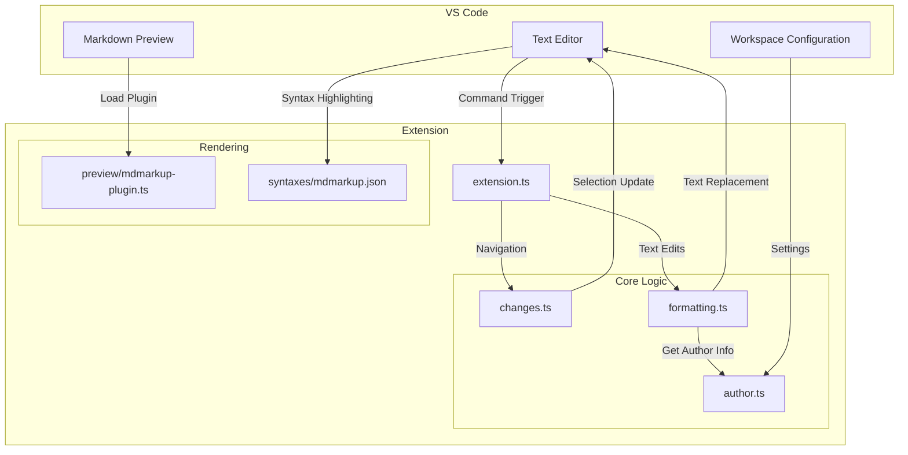
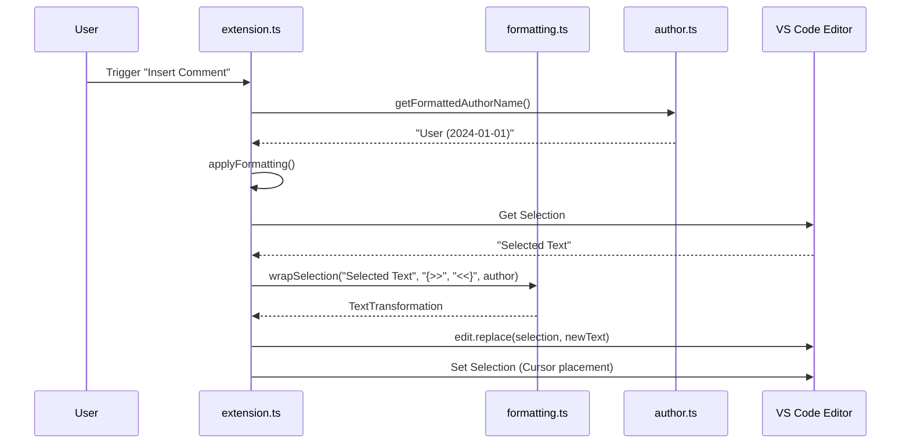
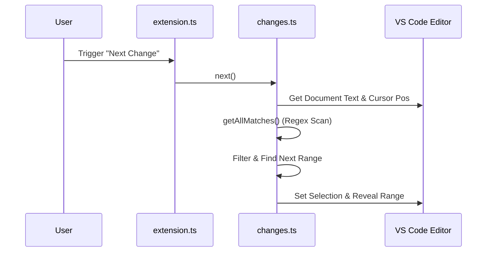

# Architecture & Code Review

## Overview

`mdmarkup` is a VS Code extension that provides comprehensive support for [CriticMarkup](https://github.com/CriticMarkup/CriticMarkup-toolkit) (annotations, comments, tracking changes) and standard Markdown formatting. It integrates deeply with VS Code's editor for text manipulation and the built-in Markdown preview for rendering.

## System Architecture

The extension operates within the VS Code Extension Host. It consists of a main entry point that registers commands and providers, and several specialized modules for different responsibilities.

## Core Modules

### 1. Entry Point (`src/extension.ts`)
- **Responsibility**: Bootstrap the extension, register commands, and wire up dependencies.
- **Key Interactions**: 
  - Registers `mdmarkup.*` and `markdown.format*` commands.
  - Returns the `extendMarkdownIt` API for the preview.

### 2. Navigation Engine (`src/changes.ts`)
- **Responsibility**: Locate and navigate between CriticMarkup patterns.
- **Implementation**:
  - Uses a global Regex `combinedPattern` to find all occurrences.
  - `getAllMatches()`: Returns sorted, non-overlapping ranges.
  - `next()`/`prev()`: Calculates the nearest range based on current cursor position.

### 3. Formatting Engine (`src/formatting.ts`)
- **Responsibility**: Pure text transformation logic.
- **Implementation**:
  - Functional approach: `(text) => TextTransformation`.
  - `TextTransformation` interface: `{ newText: string, cursorOffset?: number }`.
  - Handles complex logic like Table Reflow (`reflowTable`) and Comment insertion with author attribution.
  - **Table Reflow**: Parses ASCII tables, calculates column widths, and regenerates aligned tables.

### 4. Author & Timestamp (`src/author.ts`)
- **Responsibility**: Resolve the current user's identity for comments.
- **Logic**: Config (`mdmarkup.authorName`) > OS User (`os.userInfo()`).
- **Formatting**: Adds timestamps if enabled in settings.

### 5. Preview Rendering (`src/preview/mdmarkup-plugin.ts`)
- **Responsibility**: Extend `markdown-it` to render CriticMarkup as HTML.
- **Implementation**:
  - **Block Rule**: `mdmarkupBlock` catches multi-line patterns starting at line beginning (workaround for markdown-it paragraph splitting).
  - **Inline Rule**: `parsemdmarkup` handles inline patterns.
  - **Recursive Parsing**: Uses `addInlineContent` to allow Markdown syntax *inside* CriticMarkup tags.

## Data Flow

### Formatting Command Execution

### Navigation

---

## Code Review Analysis

Gemini 3/Warp has reviewed the codebase and found it to be well-structured and focused. Here is the detailed analysis:

### Strengths
- **Separation of Concerns**: Logic for formatting, navigation, and rendering is clearly separated.
- **Functional Core**: `formatting.ts` uses pure functions for text transformations, making it easy to test.
- **Robust Table Reflow**: The table handling logic (`parseTable`, `reflowTable`) is surprisingly complete, handling alignment colons (`:---:`) and various padding scenarios.
- **Multi-Cursor Support**: The `applyFormatting` helper in `extension.ts` correctly maps over `editor.selections`, allowing simultaneous editing of multiple regions.
- **Nested Markdown Support**: The preview plugin recursively parses content inside CriticMarkup tags, which is a nice touch often missed in simple regex implementations.

### Limitations & Risks
- **Preview Rendering Limitation**: As noted in the code comments, `mdmarkupBlock` only detects multi-line patterns if they start at the beginning of a line. A multi-line comment starting mid-sentence might not render correctly in the preview (though it highlights fine in the editor).
- **Regex Parsing**: `changes.ts` uses a single large regex. While efficient enough for typical files, extremely large files with thousands of matches might cause slight UI freezes during navigation (sync operation).
- **Author Name Detection**: `os.userInfo()` can fail in some restricted environments (e.g., some containerized dev environments or web-only VS Code), though it is wrapped in a try-catch.

### Suggestions
- **Async Parsing**: For `changes.ts`, consider moving the regex scanning to a non-blocking async pattern if large files become a use case.
- **Configuration**: Adding a setting to customize the colors of the highlights in the preview (via CSS variables) would be a nice enhancement.

---

## Plan for Human Review

Please use the following checklists to manually verify the code integrity and functionality.

### `src/extension.ts`
- [ ] **Command Registration**: Verify all commands in `package.json` are registered here.
- [ ] **Selection Handling**: Check `applyFormatting` logic for empty selections (does it fallback to word range correctly?).
- [ ] **Cursor Positioning**: Verify `cursorOffset` logic ensures the cursor ends up inside the tag/comment after insertion.
- [ ] **Error Handling**: Ensure `editor.edit` promise rejection is handled (currently it just does nothing on failure).

### `src/formatting.ts`
- [ ] **Prefix/Suffix**: Verify `wrapSelection` correctly handles all delimiters (`{++`, `{--`, etc.).
- [ ] **Table Logic**: Review `reflowTable` edge cases:
    - [ ] Tables with missing pipes at start/end.
    - [ ] Tables with varying row lengths.
    - [ ] Tables with empty cells.
- [ ] **Author Insertion**: Confirm author name is inserted *after* the opening tag `{>>@Name: ` and cursor is placed after the colon.

### `src/changes.ts`
- [ ] **Regex Correctness**: Verify `combinedPattern` captures all 5 CriticMarkup types + HTML comments.
- [ ] **Overlap Handling**: Check `getAllMatches` filtering logic. If one tag is inside another, does it behave predictably?
- [ ] **Navigation Loop**: Verify `next()` wraps to the top and `prev()` wraps to the bottom.

### `src/preview/mdmarkup-plugin.ts`
- [ ] **Markdown-it Integration**: Verify `md.block.ruler` and `md.inline.ruler` priorities. Is `before` correct?
- [ ] **Sanitization**: Ensure injected HTML tags (`<ins>`, `<mark>`) don't conflict with other plugins.
- [ ] **Multi-line Support**: Test the "start of line" limitation manually.

### `src/author.ts`
- [ ] **OS Fallback**: Run on a machine without `authorName` config to verify `os.userInfo()` works.
- [ ] **Timestamp Format**: Verify the ISO-like format `yyyy-mm-dd hh:mm`.

### `package.json` & `syntaxes/mdmarkup.json`
- [x] **Grammar Scopes**: Verify TextMate scopes (`markup.inserted`, etc.) map to standard themes correctly.
- [x] **Activation Events**: Confirm `onLanguage:markdown` is present so the extension loads.
